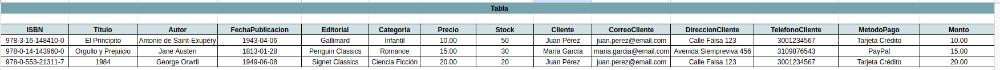
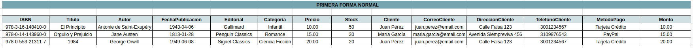
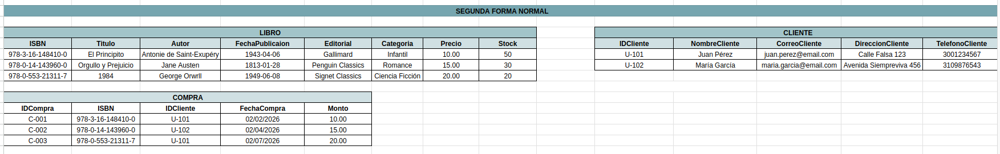
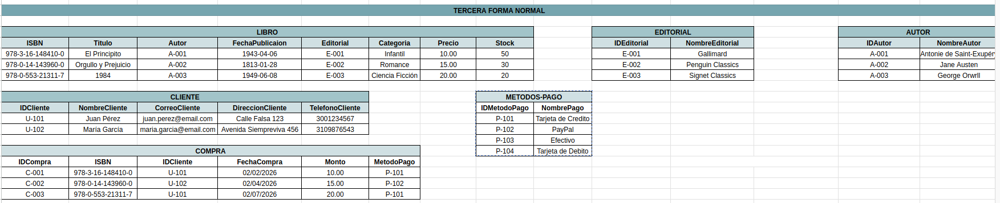
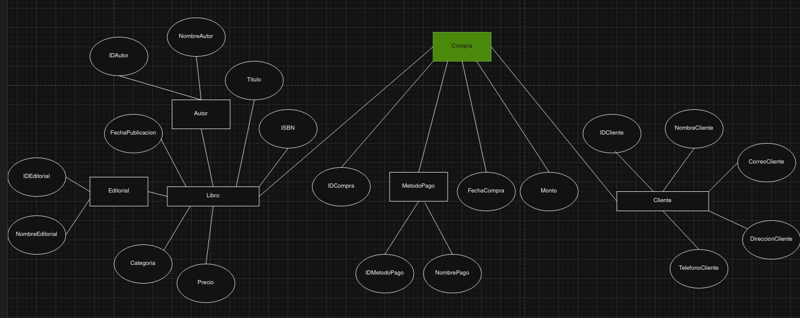
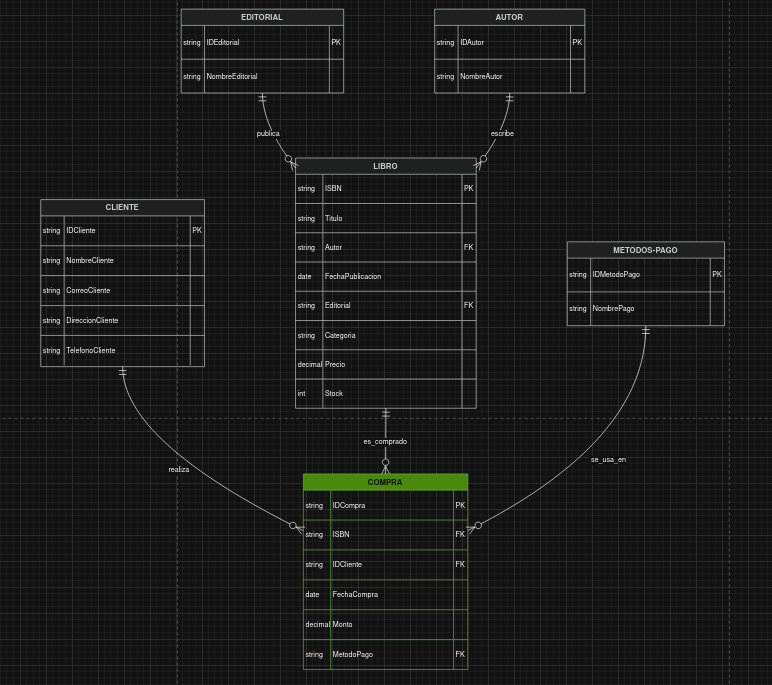

# EXAMEN - JAKELIN QUINO

## TABLA SIN NORMALIZACIÓN

## PRIMERA FORMA NORMAL

**Justificación:** La tabla ya no presentaba más datos para desestructurar (es decir que no hay campos con datos compuestos) es por eso que se dejó tal cual se presentaba para el exámen.

## SEGUNDA FORMA NORMAL

**Justificación:** En esta forma se separan los datos de los libros, los clientes y la compra, tomando en cuenta de que el ISBN ya es el ID que los libros poseen (número de identificación único), al cliente se le asigna un ID al igual que a la transacción o compra y se le agrega una fecha de la compra.

## TERCERA FORMA NORMAL

**Justificación:** Para esta última forma de normalización se considera que la tienda de libros puede tomar la decisión de cambiar de editoriales, hay libros que pueden tener más de un autor y que para la compra, un usuario puede acceder a diversas formas de pago en diferentes transacciones. 

##DIAGRAMAS

